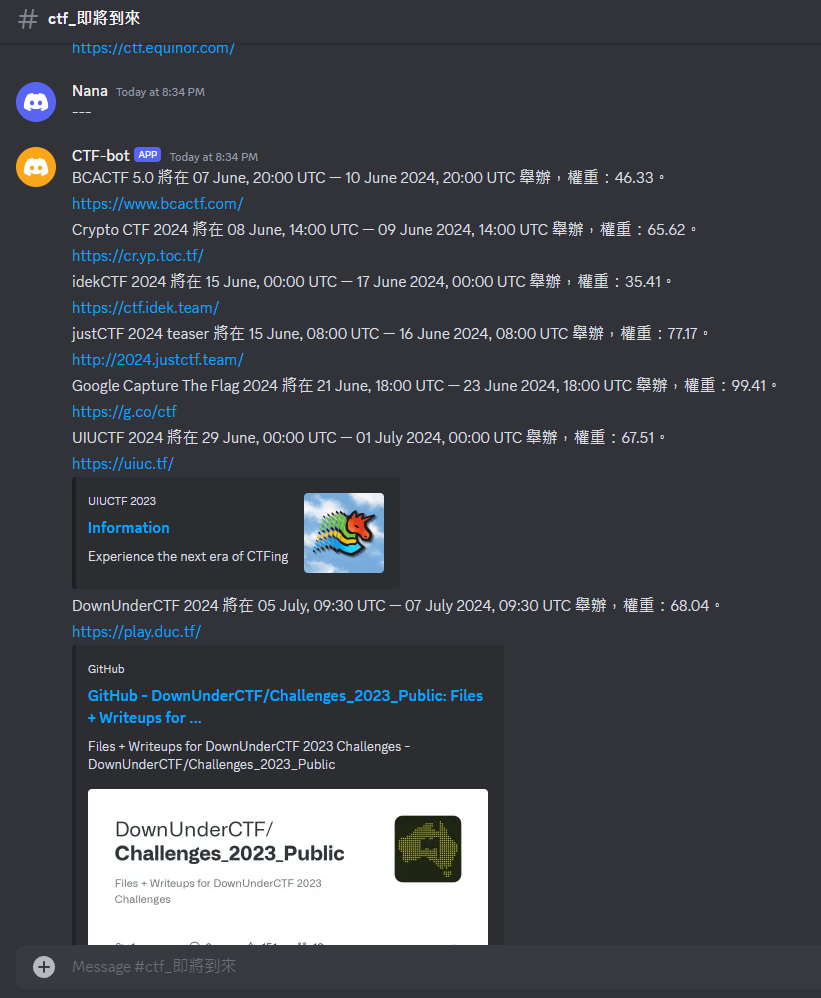
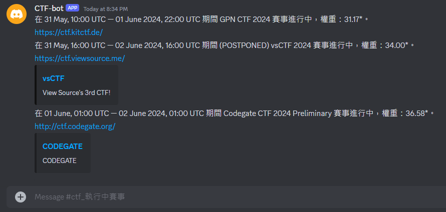

# CTF\_DC\_BOT   
## CTF 賽事推播 bot   
 --- 
由於每周舉辦的CTF賽事眾多，且低權重賽事不少，所以開發了一個賽事推播bot，定時提供高權重賽事的訊息到discord頻道中（預設24小時推播一次）   
資訊來源：[https://ctftime.org/](https://ctftime.org/)   
- 即將到來的賽事訊息   
        
- 執行中的賽事訊息   
        
   
## 安裝說明   
 --- 
以下將會引導你如何安裝此專案到你的電腦上。   
Python 建議版本為 `3.12` 以上   
- 取得專案   
    ```
    git clone git@github.com:Nana16794625829/CTF_DC_bot.git
    ```
- 進入專案資料夾   
    ```
    cd CTF_DC_bot
    ```
- 安裝packages   
    ```
    pip install -r requirements.txt
    ```
- 在CTF\_DC\_bot目錄底下建立一個.env文件，並為以下參數替換實際配置值   
    - `DC\_BOT\_TOKEN`：你的DC bot token   
    - `SERVER\_ID`：bot所在伺服器ID   
    - `UPCOMING\_CHANNEL\_ID`：bot推播即將到來的賽事之頻道ID   
    - `PROGRESSING\_CHANNEL\_ID`：bot推播進行中賽事之頻道ID   
- 運行專案   
    ```
    python bot.py
    ```
   
## 使用說明   
 --- 
將bot開啟之後，可以到伺服器對應的頻道輸入指令更改bot行為   
- 如果有在cogs底下新增指令檔   
    - `$load {指令檔檔名}` : 載入指令檔   
    - `$unload {指令檔檔名}` : 卸載指令檔   
    - `$reload {指令檔檔名}` : 如果bot開機期間修改某指令檔，可用此指令重新載入   
    - `$start\_upcoming\_event` : 開啟upcoming event推播功能   
    - `$stop\_upcoming\_event` : 關閉upcoming event推播功能   
    - `$start\_progressing\_event` : 開啟progressing event推播功能   
    - `$stop\_progressing\_event` : 關閉progressing  event推播功能   
